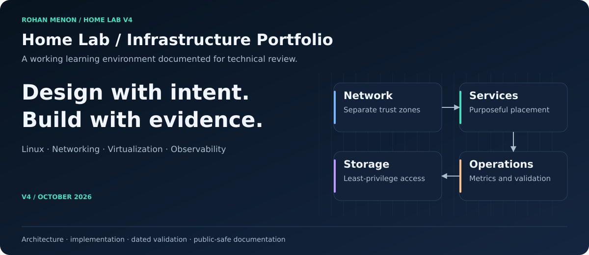
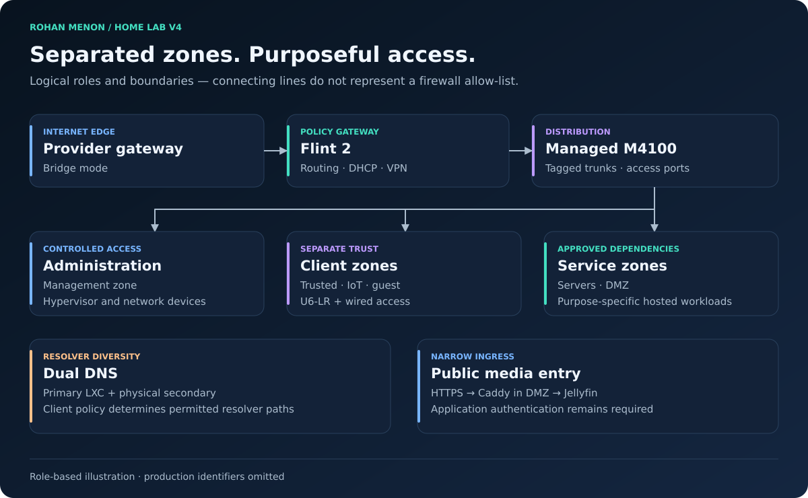

# Rohan Menon · Home Lab Portfolio

**A practical infrastructure portfolio: design, build, secure, observe, and document.**

I am transitioning from manufacturing operations and ERP systems into IT and information security. This lab turns that learning into working Linux infrastructure, controlled network boundaries, and repeatable troubleshooting. I have completed CompTIA Security+ and am studying Network+.

[Architecture](docs/architecture/network-architecture.md) · [Services](docs/services/README.md) · [Evidence](docs/validation/v4-baseline.md) · [Documentation](docs/README.md)

## What I built

| Capability | Implementation | Evidence to explore |
|---|---|---|
| Segmented networking | Flint routing, managed VLAN switch, tagged host/AP uplinks, separate client zones | [Network architecture](docs/architecture/network-architecture.md) |
| Linux virtualization | Proxmox, purpose-specific LXCs and VMs, six hosted workloads | [Service architecture](docs/architecture/service-architecture.md) |
| Controlled storage | Host-owned ext4 data, unprivileged NAS, Samba, read-only application media | [NAS implementation](docs/implementation/nas-lxc.md) |
| Containerized media | Docker/Compose Jellyfin with persistent state and DMZ HTTPS proxy | [Jellyfin](docs/services/jellyfin.md) |
| DNS resilience | Primary Pi-hole LXC plus physical secondary | [DNS migration](docs/implementation/pihole-migration.md) |
| Network management | UniFi migrated from a workstation to an always-on VM | [Controller migration](docs/implementation/unifi-controller.md) |
| Observability | Prometheus, Grafana, host metrics, six-workload backup visibility | [Monitoring](docs/services/monitoring.md) |
| Data engineering practice | Guest-scoped DNS snapshots, idempotent SQLite import, domain/service enrichment | [Analytics project](docs/services/guest-dns-analytics.md) |

## Architecture at a glance

The router owns gateways and DHCP. The managed switch carries distinct trust zones to the host and wireless access point. Proxmox separates storage, applications, DNS, monitoring, controller management, and the DMZ proxy. A physical secondary resolver stays outside the hypervisor failure domain.

The illustration describes roles; it does not expose production addresses, exact rule maps, or household device identities.

## Skills demonstrated

- **Network administration:** VLAN trunks/access ports, routed trust zones, DHCP/DNS, wireless isolation, VPN and reverse-proxy boundaries.
- **Linux and systems:** Proxmox, LXC/VM placement, systemd, SSH key access, permissions/ACLs, persistent mounts and storage diagnostics.
- **Applications and data:** Docker Compose, persistent configuration, least-privilege media access, SQLite deduplication and service enrichment.
- **Operations:** Read-only discovery, dependency-aware maintenance, metrics inspection, backup freshness, documented exceptions and rollback.
- **Technical communication:** Architecture decisions, implementation records, dated validation, clear service ownership and sanitized publication.

## Three engineering lessons

| Problem | Approach | Recorded outcome |
|---|---|---|
| Controller depended on workstation uptime | Move to a dedicated VM and verify AP communication before retirement | AP connected after cutover and old-controller rule removal |
| Application media access needed protection | Enforce permissions at NAS and client mount boundaries | Approved libraries readable; writes rejected; photos excluded |
| Backup view omitted newer workloads | Reconcile inventory, archives, metrics and dashboard panels | Six fresh backup ages and **6 / 6 PRESENT** on October 2 |

## Evidence and honest limits

**Documentation baseline: October 2, 2026.** Results reflect dated project records, not a new live audit. The lab is a single-host environment. Fresh guest backups do not prove restoration or NAS user-data coverage. Hardware transcoding, automated UPS shutdown, sustained USB stability, and completion of continuous DNS reporting still need separate evidence.

See the [V4 evidence baseline](docs/validation/v4-baseline.md) and [roadmap](docs/planning/roadmap.md). DNS observations are not confirmed website visits; raw client history is not published.

## Explore the project

| If you want to see… | Start here |
|---|---|
| Network reasoning and boundaries | [Architecture](docs/architecture/network-architecture.md) and [ADRs](docs/decisions/README.md) |
| How components were built | [Documentation index](docs/README.md) |
| What was tested and what remains open | [Evidence baseline](docs/validation/v4-baseline.md) |
| Troubleshooting and maintenance judgment | [Operations](docs/operations/operations-guide.md) and [knowledge base](docs/operations/troubleshooting.md) |
| V4 reconciliation and proposed cleanup | [Document audit](docs/release/v4-document-audit.md) and [pruning recommendations](docs/release/pruning-recommendations.md) |

## Publication and contribution

This employer-facing documentation excludes operational addresses, MACs, household identities, detailed security rules, credentials and raw logs. Non-secret operational details are maintained privately; secrets belong outside Git in all cases.

See [publication boundary](docs/standards/public-private-boundary.md), [contribution guidance](CONTRIBUTING.md), and [security policy](SECURITY.md).

[GitHub profile](https://github.com/rohanrm)
