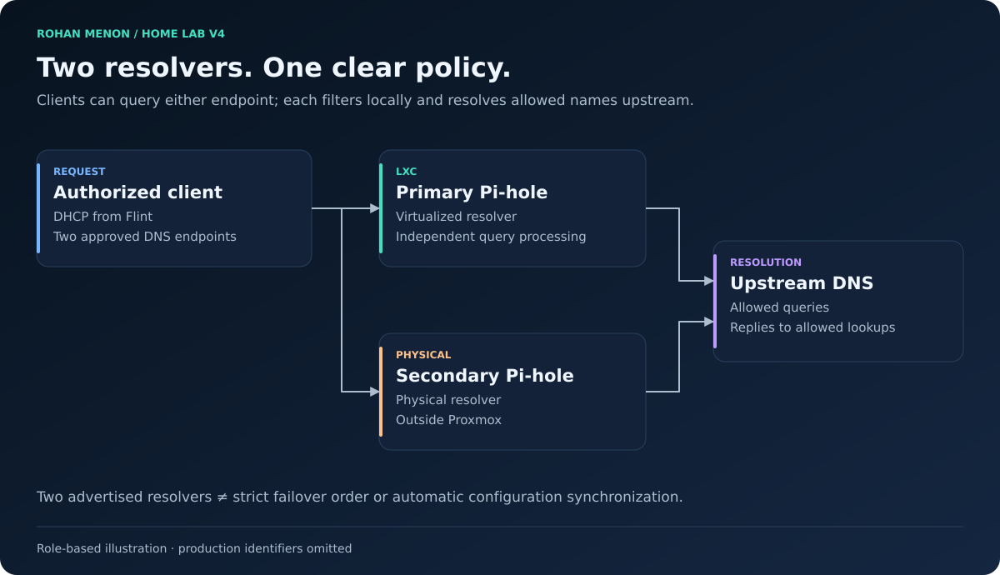

# Network Architecture

| Field | Value |
|---|---|
| Document status | Current |
| Visibility | Public |
| Last reviewed | 2026-10-02 |
| Source of truth for | Network Architecture |

## Current design

The network has moved from one trusted LAN to separate management, trusted-client, server, IoT, guest, and DMZ zones. A retained native network supports access-point management. The ISP gateway operates in bridge mode; the Flint 2 owns routing, DHCP, NAT, and inter-zone policy. The Netgear M4100 carries VLAN trunks to the router, Proxmox host, and UniFi access point.

The illustration summarizes roles. It does not publish a firewall allow-list or imply that every zone can reach every other zone.

## Zone responsibilities

| Zone | Purpose | Design constraint |
|---|---|---|
| Management | Hypervisor and network administration | Administrative access is deliberately controlled |
| Trusted | Personal client devices | Access to approved internal services |
| Servers | Storage, applications, DNS, monitoring, controller | Service-specific dependencies |
| IoT | Connected appliances | Separate from personal and management devices |
| Guest | Visitor clients | Client isolation and restricted internal access |
| DMZ | Reverse-proxy entry point | Narrow upstream service dependency |
| Native management | Access-point management continuity | Preserve the required native VLAN on the AP uplink |

Exact VLAN IDs, subnets, port membership, and firewall rules remain private.

## Wired and wireless delivery

Trunks carry several VLANs over one cable. Access ports deliver one assigned network to ordinary endpoints. The host bridge is VLAN-aware; guest interfaces receive the appropriate network tag. Management addressing resides on the host management VLAN.

The U6-LR uses Ethernet backhaul and distinct trusted, IoT, and guest SSIDs. Router radios and the legacy SSID have been retired from the active design. The guest SSID enables client isolation. Client isolation complements routed policy; it does not replace it.

The UniFi controller now runs in an always-on server VM. The AP remained connected after cutover and removal of old-controller access rules. This removes the dependency on a workstation remaining awake. See [UniFi migration](../implementation/unifi-controller.md).

## DNS and addressing

Flint remains the DHCP authority. Two Pi-hole resolvers serve the allowed client networks: a primary LXC and a secondary physical host. Clients may use either advertised resolver; the labels primary and secondary do not guarantee strict client-side failover order. Automatic configuration synchronization and a controlled resolver-loss test are not claimed.

Service endpoints use predictable infrastructure addressing. Personal management clients are intended to use router-managed reservations after address availability and stable device identity are verified. See [addressing policy](../reference/network-addressing-policy.md).

## External access

Caddy terminates HTTPS in the DMZ and forwards the approved media request to Jellyfin in the server zone. External media access was validated. Administrative interfaces, Samba, and DNS are not published as public services. WireGuard terminates on the router for authenticated access to permitted internal destinations.

TLS, authentication, routed policy, and storage permissions protect different boundaries. A reverse proxy does not make an application safe by itself. Exact hostnames, endpoints, rule names, and keys remain private.

## Limitations and remaining work

The router, managed switch, virtualization host, and data disk remain shared failure domains. Physical secondary DNS reduces reliance on the hypervisor for name resolution, but does not make the entire lab highly available. VPN egress policy and workplace-VPN exceptions remain separate planned work. See [V4 evidence](../validation/v4-baseline.md) and [ADR-0003](../decisions/adr-0003-segment-network.md).
