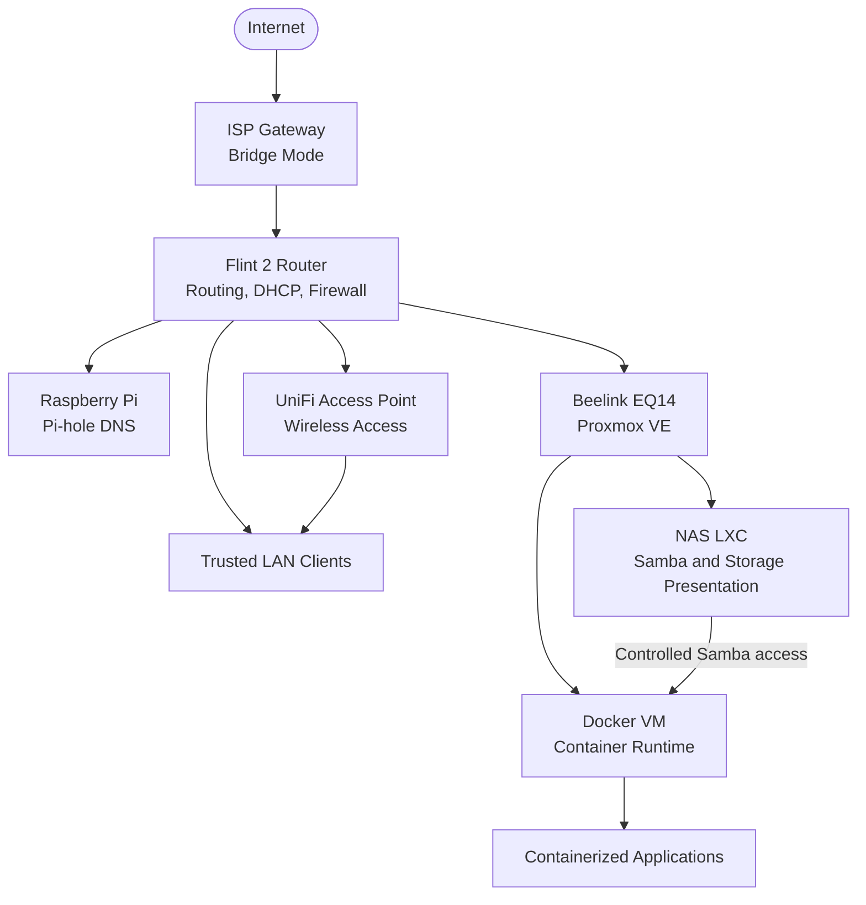
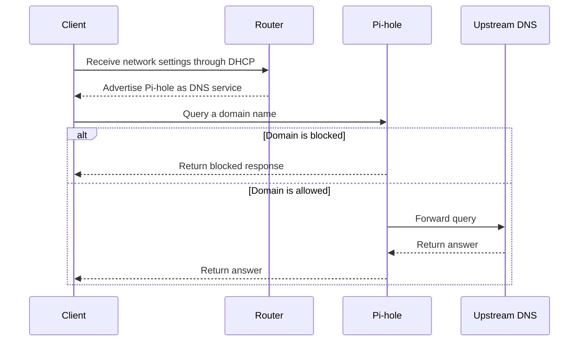

# Network Architecture

| Field | Value |
|---|---|
| Document status | Current |
| Visibility | Public |
| Last reviewed | 2026-07-21 |
| Source of truth for | Logical network roles, trust boundaries, and traffic flows |

## Purpose

This document describes the logical network architecture of the home lab.

It explains:

- Which components provide routing, addressing, DNS, wireless access, compute, and storage
- How common traffic flows move through the environment
- Where important trust boundaries exist
- Which limitations belong to the current design
- Which changes are approved or deferred

Exact internal addresses, MAC addresses, administrative URLs, household-device names, and detailed security configuration are maintained outside the public repository.

## Scope

### Included

- Internet edge and routing
- DHCP and DNS responsibilities
- Wired and wireless access
- Proxmox-hosted infrastructure
- NAS and Docker communication
- High-level service traffic
- Current trust boundaries
- Approved near-term changes

### Excluded

- Exact IP allocations
- MAC addresses
- Router and firewall rule exports
- Complete client-device inventory
- Exact physical port assignments
- Passwords, tokens, keys, and credential files
- Raw diagnostic output containing operational identifiers

## Current Architecture

The environment currently uses a single trusted home LAN.

The ISP gateway operates in bridge mode, leaving routing, DHCP, firewalling, and default-gateway responsibilities to the GL.iNet Flint 2 router.

A UniFi access point extends wireless coverage using Ethernet backhaul. The router and access point provide a shared wireless network so compatible clients can move between coverage areas without manually changing networks.

A Raspberry Pi runs Pi-hole as the network DNS filtering service.

A Beelink EQ14 runs Proxmox VE and hosts:

- An unprivileged NAS LXC
- An Ubuntu Docker VM

The NAS LXC presents persistent storage through Samba. The Docker VM consumes the media share through a persistent systemd automount with a restricted access model.

## Logical Topology



The diagram is intentionally role-based. Exact addresses and identifiers are recorded privately.

## Component Responsibilities

| Component | Responsibility | Status |
|---|---|---|
| ISP gateway | Converts the provider connection and passes traffic to the router | Operational |
| Flint 2 router | Default gateway, DHCP, routing, NAT, and perimeter firewall | Operational |
| Pi-hole host | DNS filtering for the trusted LAN | Operational |
| UniFi access point | Wireless access with Ethernet backhaul | Operational |
| Proxmox host | Runs the NAS LXC and Docker VM | Operational |
| NAS LXC | Presents persistent storage and Samba shares | Operational |
| Docker VM | Runs Docker Engine and Compose workloads | Operational |
| Jellyfin | Planned media-service workload on the Docker VM | In Progress |
| Immich | Planned photo-management workload on the Docker VM | Planned |

## Address Assignment

The router is the authoritative DHCP server for the trusted LAN.

The addressing policy separates infrastructure, servers, network equipment, reserved clients, and dynamic clients into predictable allocation groups.

The public repository documents the policy but not the exact assignments.

See [Network Addressing Policy](../reference/network-addressing-policy.md).

## DNS Flow

The Pi-hole host provides DNS filtering for clients on the trusted LAN.

A normal lookup follows this path:



Pi-hole remains on bare metal during the current application-deployment phase. Migration into the Proxmox environment is paused until Jellyfin and Immich have been deployed.

## DHCP Flow

When a client joins the network:

1. The client broadcasts a request for network configuration.
2. The Flint 2 responds as the DHCP server.
3. The client receives:
   - An address
   - The default gateway
   - DNS configuration
   - A lease duration
4. The client can then communicate with local services and the internet.

Infrastructure and servers use planned reservations rather than unpredictable dynamic assignments.

## Internet Traffic Flow

Normal internet traffic follows this path:

```text
Client
  → Flint 2 router
  → ISP gateway in bridge mode
  → Internet
```

The router performs:

- Local routing
- Network address translation
- Perimeter firewalling
- Default-gateway functions

The bridged ISP gateway does not act as the primary home router.

## Internal Service Flow

A client accessing an internal application follows this general path:

```text
Trusted client
  → LAN switching or wireless access
  → Docker VM
  → Application container
```

When the application needs media storage:

```text
Application container
  → Docker VM mount point
  → Samba connection
  → NAS LXC
  → Persistent storage
```

The application should receive only the storage access required for its role.

## Wireless Access and Roaming

The Flint 2 and UniFi access point provide wireless coverage on the same trusted LAN.

Ethernet backhaul connects the access point to the routed network. This avoids using a wireless repeater link for infrastructure traffic.

Compatible clients decide when to roam between access points. The infrastructure can assist roaming, but the client ultimately selects the access point.

## Trust Boundaries

### Internet boundary

The Flint 2 separates the trusted home LAN from the public internet.

Unsolicited inbound access should not be exposed unless a documented service requirement and security review justify it.

### Wireless boundary

Wireless clients join the same trusted LAN as wired clients in the current design.

This simplifies early deployment but provides less isolation than a segmented design.

### Virtualization boundary

The Proxmox host separates infrastructure workloads into different guests:

- The NAS runs in an unprivileged LXC.
- Containerized applications run inside a dedicated VM.

This keeps Docker workloads away from the Proxmox host operating system and provides stronger kernel isolation than running Docker directly in an LXC.

### Storage boundary

Persistent storage is mounted on the Proxmox host and bind-mounted into the NAS LXC.

The Docker VM accesses media through Samba rather than receiving the host disk directly.

This preserves a clear responsibility boundary:

- Proxmox owns the physical mount.
- The NAS LXC owns file sharing and permissions.
- The Docker VM consumes only the share it requires.

### Documentation boundary

The public repository explains design and validation.

The private repository retains exact operational identifiers, raw output, and recovery details.

Secrets are stored outside Git.

## Current Limitations

The current architecture intentionally accepts several limitations:

| Limitation | Effect |
|---|---|
| Single trusted LAN | Infrastructure, clients, and IoT devices are not yet separated by VLAN |
| Single active Pi-hole host | DNS filtering has a single active service dependency |
| Router provides central wired aggregation | Expansion is limited compared with a dedicated managed switch |
| Application stack is still being deployed | Jellyfin is not yet operational and Immich has not started |
| No approved remote-access design | Internal services are intended for trusted local access |

These are documented trade-offs, not hidden assumptions.

## Planned State

### Approved near-term work

1. Complete the Jellyfin Compose deployment.
2. Validate container startup, persistence, media access, and client access.
3. Deploy Immich after the media-service foundation is stable.
4. Reassess Pi-hole migration only after both application deployments are complete.

### Deferred network work

Network segmentation, a managed switch, and VLAN design remain deferred.

They should not be represented as current architecture. A future implementation should require:

- A defined segmentation goal
- Supported router, switch, and access-point configuration
- An addressing and firewall plan
- A rollback procedure
- Validation of inter-VLAN access rules

## Failure Dependencies

| Dependency failure | Likely effect |
|---|---|
| Flint 2 unavailable | Clients lose routing, DHCP, and normal internet access |
| Pi-hole unavailable | DNS resolution may fail unless a deliberate fallback exists |
| Proxmox host unavailable | NAS and Docker workloads become unavailable |
| Persistent storage unavailable | NAS shares and dependent applications lose data access |
| NAS LXC or Samba unavailable | Docker workloads lose shared-media access |
| Docker VM unavailable | Containerized applications become unavailable |
| Wireless access point unavailable | Coverage is reduced, while other LAN paths may remain available |

## Related Documentation

- [Physical Topology](physical-topology.md)
- [Service Architecture](service-architecture.md)
- [Network Addressing Policy](../reference/network-addressing-policy.md)
- [Infrastructure Baseline](../validation/infrastructure-baseline.md)
- [Public and Private Information Boundary](../standards/public-private-boundary.md)
- [Roadmap](../planning/roadmap.md)
