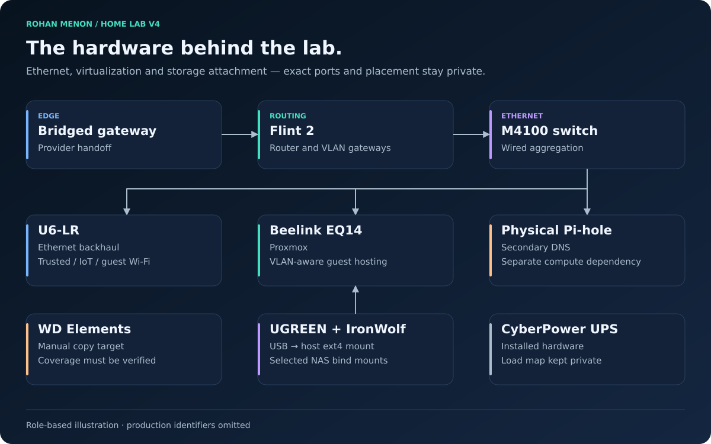

# Physical Topology

| Field | Value |
|---|---|
| Document status | Current |
| Visibility | Public |
| Last reviewed | 2026-10-02 |
| Source of truth for | Physical Topology |

## Current topology

The provider gateway feeds the Flint 2 in bridge mode. The M4100 is the managed wired aggregation point. Ethernet trunks connect routing, Proxmox, and the U6-LR; assigned access ports connect ordinary wired endpoints. The AP carries wireless client VLANs while retaining its native management network.

Lines describe connection types rather than room placement, cable routes, or physical port numbers.

## Equipment roles

| Equipment | Role | Important dependency |
|---|---|---|
| Provider gateway | Bridged handoff | Provider connection and power |
| Flint 2 | Routing, DHCP, firewall, VPN | Gateway availability |
| M4100-26G | VLAN switching and trunk distribution | Saved port membership and native VLAN policy |
| U6-LR | Ethernet-backed wireless access | Uplink and controller management reachability |
| Beelink EQ14 | Proxmox compute | Local NVMe, RAM, network trunk |
| Physical Pi-hole host | Independent secondary DNS | Network and its own power |
| UGREEN enclosure / IronWolf | Primary shared-data attachment | USB transport and host filesystem mount |
| WD Elements | Manual external backup target | Availability and verified backup copies |
| CyberPower UPS | Installed power-protection equipment | Actual protected-load map and battery condition |

UPS presence is confirmed; automated NUT shutdown and outage testing are not established by the evidence used for V4. The public drawing intentionally omits the protected outlet/load map.

## Storage observation

The host owns the ext4 data mount and presents selected directories to the NAS LXC. The Docker VM receives media over Samba. Guest backup success does not establish coverage of host bind-mounted user data.

On October 2, the enclosure was moved to another USB port after repeated disconnects. The new connection negotiated 5 Gbit/s; the data mount and Samba were healthy at the check, with no new I/O errors. The longer observation period remains open. A healthy SMART result does not rule out a USB transport problem.

## Startup and shutdown

Bring up routing and switching, the physical resolver, and the hypervisor before dependent services. Confirm the host data mount before the NAS starts using bind mounts. Start application consumers after Samba is available. Stop consumers before storage during maintenance. An automount reduces boot coupling but cannot supply a missing NAS.

## Failure domains

| Loss | Expected impact |
|---|---|
| Router or switch | Routed services and client connectivity disrupted |
| Hypervisor | Six hosted workloads unavailable; physical DNS can remain available |
| External disk/enclosure | Shared-data services lose their source storage |
| AP uplink | Wireless service interrupted |
| Backup disk | Manual backup destination unavailable |

Additional compute and larger disks are being evaluated; they are not installed components. See [hardware profile](../reference/hardware-profile.md), [operations](../operations/operations-guide.md), and [V4 evidence](../validation/v4-baseline.md).
