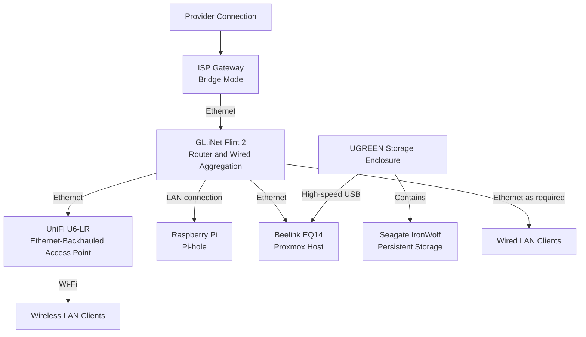

# Physical Topology

| Field | Value |
|---|---|
| Document status | Current |
| Visibility | Public |
| Last reviewed | 2026-07-21 |
| Source of truth for | Sanitized physical relationships between network, compute, and storage components |

## Purpose

This document describes how the main home-lab components are physically connected.

It focuses on equipment roles and connection types rather than publishing:

- Exact room-by-room placement
- Cable routes
- Physical port numbers
- MAC addresses
- Serial numbers
- Disk UUIDs
- Administrative access details

Those operational details belong in the private repository.

## Scope

### Included

- Provider handoff
- Router and wireless access
- Proxmox host
- External storage
- Raspberry Pi DNS host
- Ethernet and USB relationships
- Physical dependency risks
- Safe expansion principles

### Excluded

- Exact cable lengths and routes
- Wall-jack identifiers
- Router port numbers
- USB port identifiers
- Household-device locations
- Power-circuit details
- Photographs revealing the physical environment

## Current Physical Design

The topology uses the Flint 2 as the central network edge and wired aggregation point.

The Proxmox host connects to the LAN by Ethernet. A high-speed USB connection attaches the external storage enclosure to the Proxmox host.

The UniFi access point uses Ethernet backhaul rather than wireless repeating.

The Raspberry Pi running Pi-hole connects to the trusted LAN as a separate bare-metal service host.

## Physical Topology Diagram



Exact port assignments and physical placement are intentionally omitted.

## Equipment Roles

| Equipment | Physical role | Connection |
|---|---|---|
| ISP gateway | Provider handoff in bridge mode | Provider medium and Ethernet |
| Flint 2 | Router, firewall, DHCP server, and current wired aggregation point | Ethernet |
| UniFi U6-LR | Extends wireless coverage | Ethernet backhaul and Wi-Fi |
| Raspberry Pi | Independent Pi-hole host | Trusted LAN |
| Beelink EQ14 | Proxmox virtualization host | Ethernet |
| UGREEN enclosure | Houses the NAS disk | High-speed USB |
| Seagate IronWolf disk | Persistent home-lab storage | Installed in external enclosure |

## Connection Path Summary

### Internet path

```text
Provider connection
  → ISP gateway in bridge mode
  → Flint 2 router
  → Trusted LAN
```

### Wireless path

```text
Flint 2 router
  → Ethernet backhaul
  → UniFi access point
  → Wireless client
```

### Virtualization path

```text
Flint 2 router
  → Ethernet
  → Beelink EQ14
  → Proxmox guests
```

### Storage path

```text
IronWolf disk
  → UGREEN enclosure
  → High-speed USB
  → Proxmox host
  → NAS LXC bind mounts
  → Samba clients
```

## Compute and Storage Relationship

The physical storage device is attached to the Proxmox host, not passed directly to the Docker VM.

This design establishes clear ownership:

| Layer | Responsibility |
|---|---|
| Physical disk and enclosure | Stores persistent data |
| Proxmox host | Mounts the filesystem and owns the physical attachment |
| NAS LXC | Receives selected directories through bind mounts |
| Samba | Presents controlled network shares |
| Docker VM | Consumes only required shares |
| Application container | Uses its assigned application and media paths |

This prevents application containers from directly managing the physical disk.

## Wireless Design

The access point is connected by Ethernet backhaul.

Advantages include:

- No wireless backhaul bandwidth penalty
- More predictable latency
- Better reliability than repeating a wireless signal
- Central routing and addressing through the Flint 2
- A cleaner path toward future network segmentation

The current wireless network remains part of the same trusted LAN as wired clients.

## Current Wired Aggregation

The design does not currently depend on a separate managed switch.

The Flint 2 provides the available wired connections for the present environment.

This is adequate while:

- Port demand remains low
- All devices remain on one trusted LAN
- VLAN trunking is not required
- Link aggregation is not required
- Central switch monitoring is not required

A managed switch may become justified when segmentation, additional wired devices, PoE requirements, or improved observability become approved needs.

## Power and Startup Dependencies

The public repository does not document exact outlets, circuits, or power-strip layout.

At a functional level, startup depends on:

1. Router and LAN availability
2. Proxmox host startup
3. Persistent storage mounting on the host
4. NAS LXC startup
5. Samba availability
6. Docker VM startup
7. Application container startup

The separate bare-metal Pi-hole host also depends on LAN and power availability.

## Physical Trust and Safety Considerations

- The virtualization host and storage enclosure should remain physically stable and ventilated.
- Storage cabling should not be placed under tension.
- The external disk should not be disconnected while mounted.
- Network and power cables should be labelled in the private operational record.
- Administrative interfaces should not be exposed merely because the equipment is physically inside the home.
- Photographs intended for public use should be reviewed for labels, serials, QR codes, addresses, or other identifying details.

## Single Points of Failure

| Component | Physical dependency | Effect if unavailable |
|---|---|---|
| Flint 2 | Central router and wired aggregation | Loss of normal LAN routing and DHCP |
| Beelink EQ14 | Hosts both infrastructure guests | Loss of NAS and Docker workloads |
| External disk or enclosure | Primary persistent storage | Loss of shared data availability |
| Uplink to access point | Wireless backhaul | Reduced wireless coverage |
| Pi-hole host | Active DNS filtering service | DNS disruption unless a fallback is configured |

Documenting these dependencies supports future backup, monitoring, and redundancy work.

## Expansion Boundaries

### Approved near-term expansion

The current physical platform is sufficient for completing Jellyfin and beginning Immich planning.

### Deferred expansion

The following are not part of the current topology:

- Managed switch
- VLAN trunking
- Additional access points
- Dedicated backup storage
- Uninterruptible power supply
- Secondary active DNS host
- Additional Proxmox nodes

These may be evaluated later but should not appear as installed equipment.

## Private Operational Records

The following belong in the private repository:

- Cable map
- Physical port map
- Exact USB port selection
- Detailed device placement
- Serial numbers
- Hardware identifiers
- Disk UUIDs
- Warranty information
- Photographs containing identifying labels

## Related Documentation

- [Network Architecture](network-architecture.md)
- [Service Architecture](service-architecture.md)
- [Hardware Profile](../reference/hardware-profile.md)
- [Inventory Summary](../reference/inventory-summary.md)
- [Public and Private Information Boundary](../standards/public-private-boundary.md)
