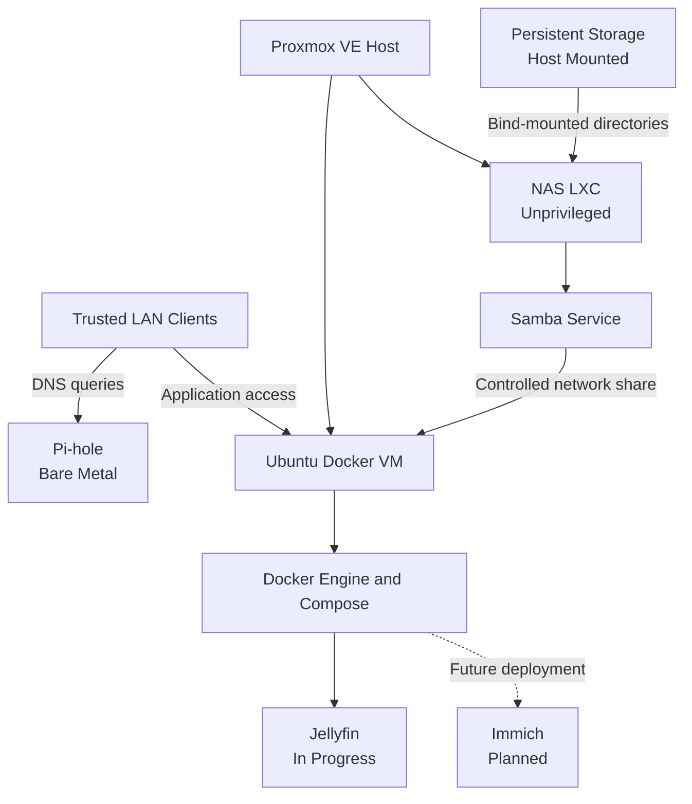
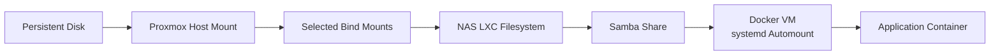
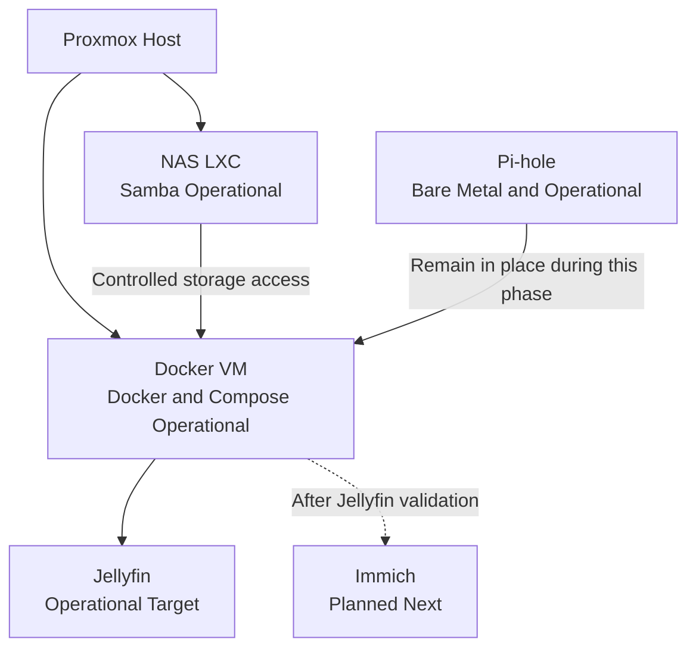

# Service Architecture

| Field | Value |
|---|---|
| Document status | Current |
| Visibility | Public |
| Last reviewed | 2026-07-21 |
| Source of truth for | Service placement, platform boundaries, dependencies, and lifecycle state |

## Purpose

This document explains where home-lab services run, how they depend on one another, and why the current design separates storage, container workloads, and DNS across different platforms.

It distinguishes:

- Current operational services
- Work that is actively in progress
- Approved planned services
- Deferred migrations
- Ideas that are not part of the active architecture

## Design Goals

The service architecture is intended to provide:

- Clear separation of responsibilities
- Persistent storage independent of application containers
- Rebuildable container workloads
- Predictable startup and dependency order
- Least-privilege access to shared data
- Low overhead on modest hardware
- Documentation that distinguishes installation from validation
- A path for gradual expansion without premature complexity

## Current Architecture

The Proxmox host runs two primary guests:

1. An unprivileged NAS LXC
2. An Ubuntu Docker VM

The NAS LXC receives selected persistent-storage directories from the Proxmox host through bind mounts. It publishes required storage through Samba.

The Docker VM runs Docker Engine and Compose. It mounts the NAS media share through a persistent systemd automount.

Pi-hole remains on a separate Raspberry Pi as a bare-metal DNS filtering service.

Jellyfin preparation has begun, but the application is not yet deployed as a running Compose service. Immich is approved as a later planned service.

## Current Service Diagram



The Jellyfin node represents the active deployment project, not a currently running container.

## Platform Allocation

| Service or function | Platform | Status | Reason |
|---|---|---|---|
| Proxmox VE | Bare-metal Beelink host | Operational | Provides virtualization and guest lifecycle management |
| Persistent disk mount | Proxmox host | Operational | Keeps physical storage ownership at the host layer |
| NAS filesystem presentation | Unprivileged LXC | Operational | Low overhead and direct bind-mount support |
| Samba | NAS LXC | Operational | Centralizes network file sharing and permissions |
| Docker Engine and Compose | Ubuntu VM | Operational | Provides a conventional Docker environment with VM isolation |
| Samba systemd automount | Docker VM | Operational | Connects applications to NAS media without storing credentials in `fstab` |
| Pi-hole | Raspberry Pi bare metal | Operational | Maintains stable DNS while application services are deployed |
| Jellyfin | Docker VM | In Progress | Persistent directories prepared; Compose deployment not complete |
| Immich | Docker VM | Planned | Approved after the media-service foundation is stable |
| Plex | Not allocated | Idea | Possible future alternative, not active roadmap work |
| Home Assistant | Not allocated | Idea | Exploration item, not an approved service |

## Why the NAS Uses an LXC

The NAS workload benefits from:

- Low memory overhead
- Fast startup
- Direct bind mounts from the Proxmox host
- A dedicated Linux userspace for Samba
- Separation from the Proxmox host's normal administrative environment

The LXC is unprivileged to reduce the impact of a container compromise.

The NAS LXC does not own the physical disk. It receives only the directories selected by the host configuration.

## Why Docker Uses a VM

Docker runs in a dedicated Ubuntu VM rather than directly on the Proxmox host or nested inside the NAS LXC.

This provides:

- A standard Docker installation model
- Stronger kernel isolation than an LXC
- Separation between application failures and NAS services
- Easier use of normal Docker and Compose documentation
- A rebuildable application host
- Reduced risk of Docker networking or firewall changes affecting the Proxmox host

The trade-off is higher memory use than a Docker-in-LXC design.

## Storage Architecture

### Physical ownership

The Proxmox host mounts the persistent filesystem.

### NAS presentation

Selected host directories are bind-mounted into the NAS LXC.

The NAS LXC applies:

- Linux ownership
- Group permissions
- Access control lists where required
- Samba share definitions

### Docker consumption

The Docker VM mounts the required Samba share through systemd automount.

The media access boundary is designed so the application host can read the required media while write access remains restricted unless a future service explicitly requires it.

### Application persistence

Container configuration and cache directories live on the Docker VM under a controlled service directory.

Application containers should be disposable. Persistent data must remain in:

- Bind-mounted application directories
- Named volumes when deliberately selected
- NAS-backed data locations where appropriate

A container image is not treated as a backup.

## Storage Flow



## Startup and Dependency Order

The intended dependency chain is:

```text
Proxmox host
  → Persistent storage mount
  → NAS LXC
  → Samba service
  → Docker VM
  → Samba automount on first access
  → Docker application containers
```

Systemd automount reduces boot-time coupling because the remote share is mounted when accessed rather than requiring an immediate successful mount during early boot.

Application deployment must still account for the possibility that storage is temporarily unavailable.

## Current Service State

### Operational

- Proxmox VE
- NAS LXC
- Persistent storage bind mounts
- Samba
- Docker VM
- Docker Engine
- Docker Compose
- Permanent Samba systemd automount
- Bare-metal Pi-hole

### In Progress

#### Jellyfin

The Docker host and persistent Jellyfin directories are prepared.

The deployment remains incomplete because the active Jellyfin directory does not yet contain the final Compose definition and no Jellyfin container is currently running.

The next transition is:

```text
In Progress
  → Implemented
  → Validated
  → Operational
```

### Planned

#### Immich

Immich is approved for later deployment after the Jellyfin foundation is complete and validated.

### Paused

#### Pi-hole migration

Migration of Pi-hole into the Proxmox environment is paused.

The existing Raspberry Pi remains the operational DNS filtering host until Jellyfin and Immich have been deployed.

### Ideas

Plex and Home Assistant are not approved services.

They belong in [Future Exploration](../planning/future-exploration.md), not in the active target architecture.

## Service Access Model

| Relationship | Intended access |
|---|---|
| Trusted clients to Pi-hole | DNS requests |
| Trusted clients to application services | Internal application access |
| Docker VM to NAS media share | Restricted service access |
| NAS LXC to host storage | Only configured bind-mounted directories |
| Application containers to Docker host | Only declared mounts, ports, and runtime resources |
| Public internet to internal applications | Not approved by the current architecture |

Exact ports, addresses, credentials, and firewall rules are private operational details.

## Security Boundaries

### Proxmox host boundary

The host should run only virtualization and host-level storage responsibilities required for the design.

Application services should not be installed directly on the Proxmox host.

### NAS boundary

The NAS LXC centralizes storage permissions and Samba access.

The LXC is unprivileged and receives only defined host paths.

### Docker boundary

Docker workloads run inside a VM to contain:

- Container networking
- Docker daemon privileges
- Image and Compose lifecycle
- Application-specific failures

### Credential boundary

Samba credentials are stored in a root-restricted credential file on the Docker VM rather than embedded in `/etc/fstab`.

Secrets are not stored in either documentation repository.

### Public documentation boundary

Public service documents describe roles, dependencies, and validation without publishing exact operational identifiers.

## Backup Boundaries

The architecture distinguishes between rebuildable and irreplaceable data.

| Data | Characteristic | Backup priority |
|---|---|---|
| Docker images | Re-downloadable | Low |
| Compose definitions | Rebuild instructions | High |
| Application configuration | Persistent and service-specific | High |
| Cache | Usually re-creatable | Low |
| Media library | User data | High |
| NAS permissions and Samba configuration | Required for recovery | High |
| Proxmox guest configuration | Required for efficient recovery | High |
| Secrets | Required but stored outside Git | High, through a secure secrets system |

Backup implementation and restore validation remain separate project work.

## Current Constraints

- The Proxmox host has finite memory and should not receive unnecessary guests.
- The Docker VM currently has a fixed memory allocation suitable for the initial workload.
- The storage design depends on one external disk and enclosure.
- The application stack depends on Samba availability for media access.
- DNS filtering currently depends on one active Pi-hole host.
- Network segmentation is not yet implemented.
- Jellyfin is not operational until its Compose deployment and validation are complete.

## Approved Near-Term Target State



The near-term target does not include:

- Plex deployment
- Home Assistant deployment
- Pi-hole migration
- VLAN implementation
- A second Proxmox node

## Revalidation Triggers

The service architecture should be reviewed after:

- A new service becomes operational
- Storage ownership or mount paths change
- Docker moves to another host
- Pi-hole is migrated
- VLANs or firewall zones are introduced
- A backup platform is deployed
- A service receives approved external access
- The Proxmox host receives a major platform upgrade

## Related Documentation

- [Network Architecture](network-architecture.md)
- [Physical Topology](physical-topology.md)
- [Service Catalogue](../services/README.md)
- [NAS LXC Implementation](../implementation/nas-lxc.md)
- [Docker VM Implementation](../implementation/docker-vm.md)
- [Jellyfin Implementation](../implementation/jellyfin.md)
- [Infrastructure Baseline](../validation/infrastructure-baseline.md)
- [Roadmap](../planning/roadmap.md)
- [Future Exploration](../planning/future-exploration.md)
