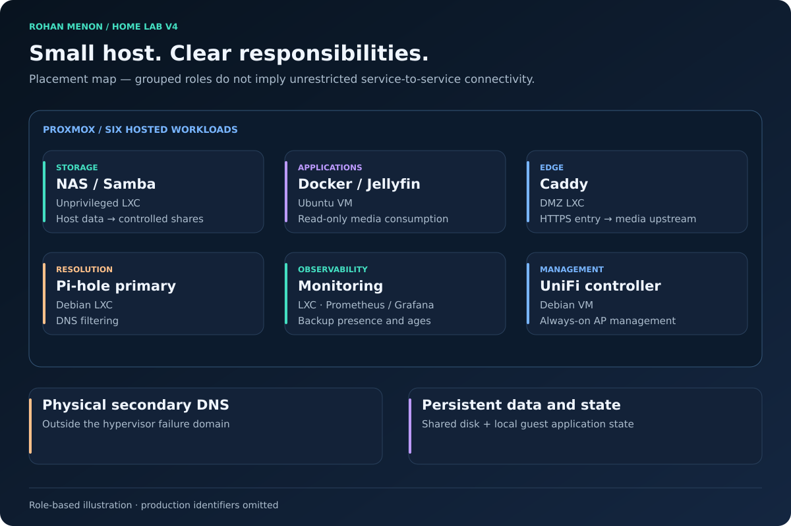

# Service Catalogue

| Field | Value |
|---|---|
| Document status | Current |
| Visibility | Public |
| Last reviewed | 2026-10-02 |
| Source of truth for | Service Catalogue |

## Current service state

| Service | Placement | Lifecycle | Evidence / limitations |
|---|---|---|---|
| [Samba](samba.md) | NAS LXC | Operational | Storage presentation and restricted media access verified |
| [Docker / Jellyfin](jellyfin.md) | Ubuntu VM | Operational | Running service and external access recorded; GPU/restore checks remain separate |
| [Pi-hole](pihole.md) | Primary LXC + physical secondary | Operational | Migration and dual resolver paths recorded |
| [Caddy](caddy.md) | DMZ LXC | Operational | External HTTPS access validated |
| [Monitoring](monitoring.md) | Monitoring LXC + host exporter | Operational | Exporter path and six-workload backup display verified |
| [UniFi](unifi-controller.md) | Dedicated VM | Operational | AP connected after migration and old-rule removal |
| [Guest DNS analytics](guest-dns-analytics.md) | Monitoring guest | In Progress | Snapshot imports and service mapping; continuous collection/dashboard unconfirmed |
| Immich | Not deployed in verified evidence | Planned | Separate privacy and backup design required |

This catalogue reflects the evidence cutoff of October 2, 2026. V4 is a documentation update, not a fresh live audit of the lab. [V4 baseline](../validation/v4-baseline.md) records dated observations and limits.

## Ownership and recovery

The router owns gateway, DHCP, and WireGuard services. The hypervisor owns physical mounts and guest lifecycle. NAS permissions, application state, DNS settings, controller configuration, and observability data have separate recovery needs. Secrets stay outside Git in both repository variants.

See [service architecture](../architecture/service-architecture.md), [operations](../operations/operations-guide.md), and [roadmap](../planning/roadmap.md).
