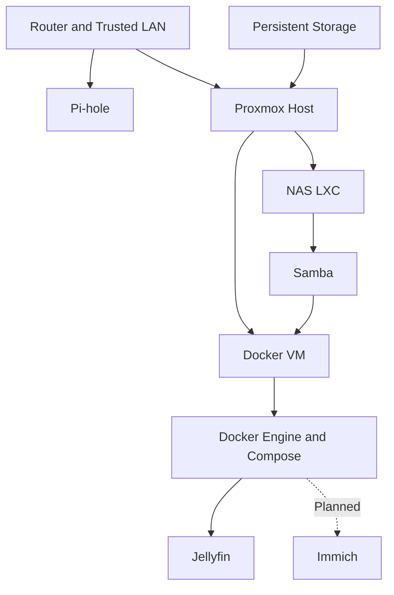

# Service Catalogue

| Field | Value |
|---|---|
| Document status | Current |
| Visibility | Public |
| Last reviewed | 2026-07-21 |
| Source of truth for | Service ownership, platform placement, lifecycle status, and documentation links |

## Purpose

This catalogue provides a single public index of the services and infrastructure functions currently used or approved for the home lab.

It answers four questions:

1. What does the service do?
2. Where does it run?
3. What is its current lifecycle status?
4. Which document is the source of truth for its operation?

Exact internal addresses, administrative URLs, usernames, guest IDs, credentials, and hardware identifiers remain private.

## Status Summary

| Service or function | Platform | Role | Status |
|---|---|---|---|
| Proxmox VE | Beelink virtualization host | Runs and manages infrastructure guests | Operational |
| Host storage mount | Proxmox host | Owns the physical shared-data filesystem | Operational |
| NAS LXC | Unprivileged LXC | Presents persistent storage to services | Operational |
| Samba | NAS LXC | Provides controlled network file sharing | Operational |
| Docker Engine | Ubuntu VM | Runs application containers | Operational |
| Docker Compose | Ubuntu VM | Defines and manages application stacks | Operational |
| Samba systemd automount | Docker VM | Provides on-demand access to NAS media | Operational |
| Pi-hole | Raspberry Pi | Provides DNS filtering | Operational |
| Jellyfin | Docker VM | Provides media streaming | In Progress |
| Immich | Docker VM | Planned photo-management service | Planned |

## Platform Boundaries

### Proxmox host

The Proxmox host is responsible for:

- Virtualization
- Guest lifecycle
- Host-level storage mounting
- Required host networking
- Hardware monitoring

Normal user applications are not installed directly on the Proxmox host.

### NAS LXC

The NAS LXC is responsible for:

- Linux ownership and permissions
- Storage presentation
- Samba share definitions
- Read/write access boundaries
- Controlled access to the media, documents, downloads, and shared areas

### Docker VM

The Docker VM is responsible for:

- Docker Engine
- Docker Compose
- Application configuration directories
- Container lifecycle
- Application logs
- On-demand access to NAS-hosted media

### Bare-metal Pi-hole host

The existing Raspberry Pi remains the active DNS filtering host while the application platform is being completed.

## Service Catalogue

### Proxmox VE

**Status:** Operational

**Role:** Provides the virtualization layer for the NAS LXC and Docker VM.

**Primary documents:**

- [Implementation](../implementation/proxmox-host.md)
- [Validation](../validation/proxmox-host.md)
- [Hardware profile](../reference/hardware-profile.md)

### NAS LXC

**Status:** Operational

**Role:** Receives selected persistent-storage directories from the Proxmox host and provides a dedicated environment for Samba.

**Primary documents:**

- [Implementation](../implementation/nas-lxc.md)
- [Validation](../validation/nas-lxc.md)
- [Service architecture](../architecture/service-architecture.md)

### Samba

**Status:** Operational

**Role:** Provides controlled access to shared storage, including read-only media access for the Docker application host.

**Primary documents:**

- [Service record](samba.md)
- [NAS implementation](../implementation/nas-lxc.md)
- [Automount implementation](../implementation/samba-systemd-automount.md)
- [NAS validation](../validation/nas-lxc.md)

### Docker Engine and Compose

**Status:** Operational

**Role:** Provides the container runtime and declarative application-deployment workflow.

**Primary documents:**

- [Docker VM implementation](../implementation/docker-vm.md)
- [Docker VM validation](../validation/docker-vm.md)

### Pi-hole

**Status:** Operational

**Role:** Provides DNS filtering for the trusted LAN.

**Current boundary:** Migration is paused until Jellyfin and Immich have been deployed.

**Primary documents:**

- [Service record](pihole.md)
- [Network architecture](../architecture/network-architecture.md)
- [Roadmap](../planning/roadmap.md)

### Jellyfin

**Status:** In Progress

**Role:** Intended to provide media-library browsing and streaming from approved NAS media directories.

**Current boundary:** The Docker platform and storage prerequisites are ready, but the active Jellyfin directory does not yet contain the final Compose deployment.

**Primary documents:**

- [Service record](jellyfin.md)
- [Implementation](../implementation/jellyfin.md)
- [Validation](../validation/jellyfin.md)

### Immich

**Status:** Planned

**Role:** Planned photo-management service.

**Entry condition:** Jellyfin must be operational and the application-deployment pattern must be stable before Immich begins.

**Primary documents:**

- [Roadmap](../planning/roadmap.md)
- [Future exploration](../planning/future-exploration.md)
- [Service architecture](../architecture/service-architecture.md)

## Dependency Map



## Lifecycle Rules

A service moves through the following states:

```text
Idea
  → Planned
  → In Progress
  → Implemented
  → Validated
  → Operational
```

A service may also be:

- Paused
- Blocked
- Retired
- Rejected

Installation alone does not make a service operational.

## Service Promotion Checklist

Before a service becomes `Operational`:

- [ ] Deployment is complete.
- [ ] Persistent data locations are identified.
- [ ] Access and permission boundaries are documented.
- [ ] Startup behaviour is confirmed.
- [ ] Logs show no unresolved critical errors.
- [ ] Validation criteria pass.
- [ ] Backup requirements are documented.
- [ ] Public documentation is sanitized.
- [ ] Private operational records contain required exact values.
- [ ] Catalogue and changelog are updated.

## Related Documentation

- [Service Architecture](../architecture/service-architecture.md)
- [Roadmap](../planning/roadmap.md)
- [Future Exploration](../planning/future-exploration.md)
- [Operations Guide](../operations/operations-guide.md)
- [Troubleshooting Guide](../operations/troubleshooting.md)
- [Public and Private Information Boundary](../standards/public-private-boundary.md)
