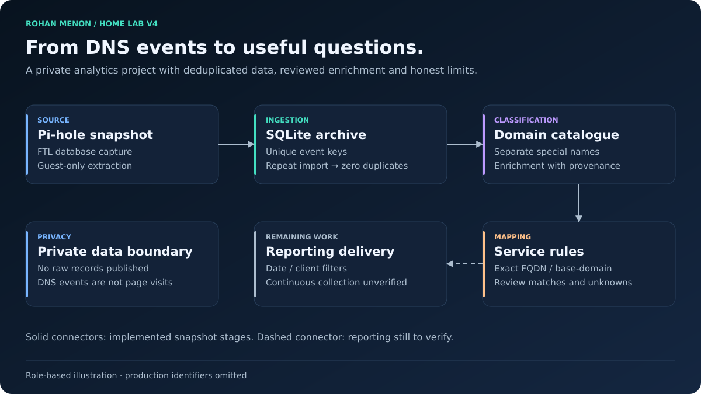

# Guest DNS Analytics

| Field | Value |
|---|---|
| Document status | Current |
| Visibility | Public |
| Last reviewed | 2026-10-02 |
| Source of truth for | Guest DNS Analytics |
| Service status | In Progress |

## Scope and current state

The project extracts DNS query records for the guest network into a dedicated SQLite archive on the monitoring guest. It supports deduplication and domain/service enrichment without publishing raw query history. Work is in progress.

## Implemented stages

| Stage | Recorded result |
|---|---|
| Source capture | Pi-hole FTL database snapshot retained and checksum-verified |
| Guest scope | Extraction restricted to guest-subnet clients |
| Import | Unique event keys prevent duplicate snapshot ingestion |
| Initial proof | Re-import added zero rows |
| Archive expansion | A later snapshot introduced genuinely new records |
| Classification | Internal/reverse/resolver names treated separately from public domain names |
| Service mapping | Reviewed exact-FQDN and base-domain rules; batch 4 commit reported |

The initial import validated deduplication. Later counters changed as new snapshots and rules were added; V4 does not present an old coverage percentage as the final batch-4 result.

## Interpretation limits

DNS activity is not a count of human visits. Background telemetry, prefetch, cached answers, application APIs, and encrypted DNS can change what appears. A client IP is not a reliable person identity. Service mapping identifies likely infrastructure families; it does not prove the user opened that service.

Registrant-domain extraction must use a documented suffix-aware method, and rule precedence must resolve conflicting matches explicitly. Treat unclassified names as unknown rather than forcing attribution. Keep source provenance and mapping changes reversible.

## Privacy and remaining delivery

The database, domains associated with clients, raw logs, and client/date histories remain private. Public illustrations contain no household browsing records. Continuous collection, ingesting both resolvers, scheduled retention, and the finished date/client reporting dashboard are not verified completed outcomes.

See [implementation](../implementation/guest-dns-analytics.md), [evidence](../validation/v4-baseline.md), and [roadmap](../planning/roadmap.md).
