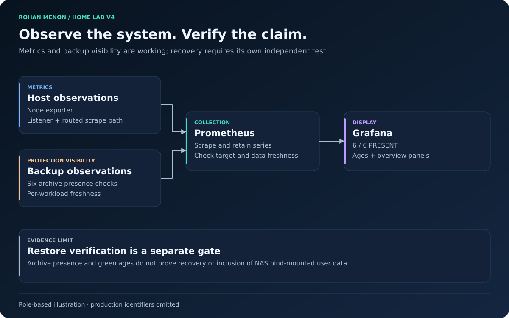

# Monitoring and Backup Visibility

| Field | Value |
|---|---|
| Document status | Current |
| Visibility | Public |
| Last reviewed | 2026-10-02 |
| Source of truth for | Monitoring and Backup Visibility |
| Service status | Operational |

## Current state

Grafana and Prometheus run in a dedicated monitoring LXC. The Proxmox node-exporter listener was corrected and its routed scrape path was permitted. Backup metrics feed the Backup Status dashboard.

## Six-workload protection view

The October 2 record confirms fresh successful archives for Caddy, NAS, Docker, primary DNS, monitoring, and UniFi. Grafana displayed **6 / 6 PRESENT**, six fresh backup ages, and a populated age overview. The exported dashboard JSON was validated and checksum-recorded privately.

| Check | Meaning | Does not establish |
|---|---|---|
| Exporter reachable | Metrics path works | Every service is healthy |
| Prometheus data fresh | Current observations arrive | Alerts are delivered |
| Archive present | Backup artifact was found | Artifact can restore |
| Six green ages | Recorded backups are recent | NAS bind-mount data is included |
| Dashboard export verified | Configuration can be retained | Entire recovery chain is tested |

## Operations

Inspect Grafana and Prometheus service state and target health. Compare dashboard values with actual archives after schema or collector changes. Preserve dashboard definitions and configuration through protected backups. A missing series and a failed backup are different conditions; display missing/stale data explicitly rather than treating it as zero or healthy.

## Limitations

Restoration, external alert delivery, UPS automated shutdown, and full user-data coverage require independent evidence. A backup stored on the same shared-data disk does not protect against loss of that disk. See [V4 baseline](../validation/v4-baseline.md) and [roadmap](../planning/roadmap.md).
